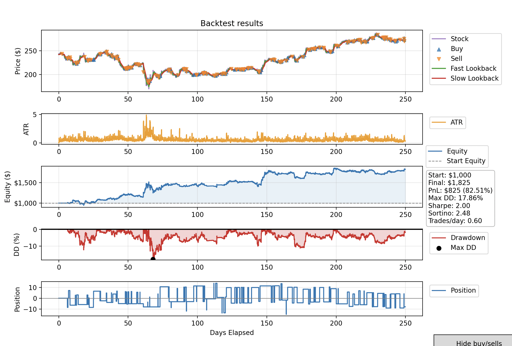

Work-in-progress backtester featuring a C++ event-driven backtesting engine,  
CSV market-data ingestion, and a Python front-end for visualisation and plotting.

## Installation

### Requirements
- CMake ≥ 3.12
- C++17 compiler (MSVC recommended on Windows)
- vcpkg

---

### 1) Clone repository

```bash
git clone --recursive https://github.com/AndrewGossenPerez/Backtester.git
cd Backtester
```
### 2) Install vcpkg
```bash
git clone https://github.com/microsoft/vcpkg
cd vcpkg
```
#### Windows
```bash
.\bootstrap-vcpkg.bat
.\vcpkg install curl nlohmann-json
```
#### Linux / macOS
```bash
./bootstrap-vcpkg.sh
./vcpkg install curl nlohmann-json
```
### 3) Configure project
#### Windows
```bash
cmake -S . -B build ^
  -DCMAKE_TOOLCHAIN_FILE=../vcpkg/scripts/buildsystems/vcpkg.cmake ^
  -DVCPKG_TARGET_TRIPLET=x64-windows
```
### Linux / macOS
```bash
cmake -S . -B build \
  -DCMAKE_TOOLCHAIN_FILE=../vcpkg/scripts/buildsystems/vcpkg.cmake
```
### 4) Build
#### Windows
```bash
cmake --build build --config Release
```
#### Linux / macOS
```bash
cmake --build build -j
```
### 5) Run 
#### Windows
```bash
.\build\Release\trading_main.exe
```
#### Linux / macOS
```bash
./build/trading_main
```

## Core components:

- C++ event-driven backtesting engine
- Inbuilt Stop Loss system
- CSV market-data ingestion
- Python visualisation layer
- Strategy prototyping framework

## Event Architecture:

Each market bar propagates through the following event pipeline:

1. **Strategy Handler**  
   Receives a `MarketEvent` (new bar) and generates a `SignalEvent` (Buy/Sell/Hold).

2. **Risk Handler**  
   Processes the `SignalEvent` and generates an `OrderEvent` according to the risk model.

3. **Execution Handler**  
   Simulates market execution and converts the `OrderEvent` into an authoritative `FillEvent`.

4. **Portfolio Handler**  
   Processes the `FillEvent`, which in turn updates position 

## Backtests currently include **transaction costs**:

- Slippage: **2.8 bps**
- Fee: **1.0 bps**
> These can be modified in [`config.hpp`](include/data/config.hpp).  
---

## Recent Benchmarks (18/05/2026)

### Dataset
- **7,371,037 OHLCV bars**
- Single-threaded execution (Intel Ultra 7 270k Plus CPU)
- 100 runs (with warmup)
- Simple EMA signaller and volatility sizer strategy

| Metric | Value |
|---|---:|
| Dataset size | **7.37M OHLCV bars** |
| Median runtime | **0.701 s** |
| Mean runtime | **0.718 ± 0.112 s** |
| p90 runtime | **0.713 s** |
| Min / Max | **0.695 / 1.655 s** |
| Median bars/sec | **10.5M** |
| Mean bars/sec | **10.3M** |
| p90 bars/sec | **10.3M** |
| Median fills | **4,742** |
| Median fills/sec | **6,768** |

---

### CSV Ingestion

| Metric | Value |
|---|---:|
| Dataset size | **7.37M OHLCV bars** |
| Median runtime | **0.611 s** |
| Mean runtime | **0.631 ± 0.047 s** |
| p90 runtime | **0.692 s** |
| Median bars/sec | **12.1M** |
| Mean bars/sec | **11.7M** |

### Notes

- Median used to reduce variance from system noise  
- Warmup runs performed before measurement  
- Includes full event pipeline (strategy → risk → execution → portfolio)  
---

## Future Work

Planned improvements:

- Build system 
- Optimisations 
- Strategy parameter heatmaps

