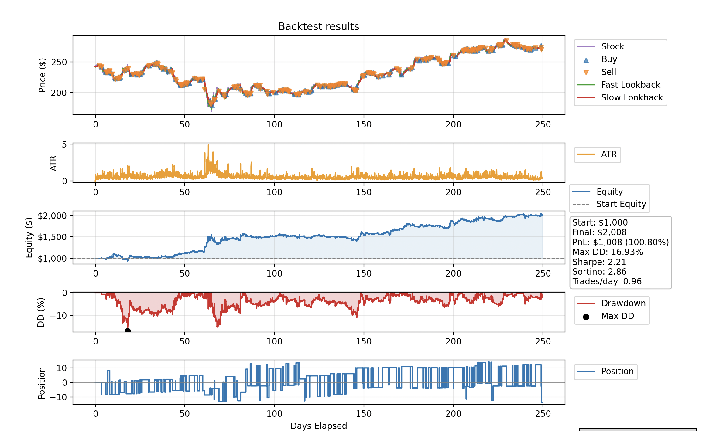
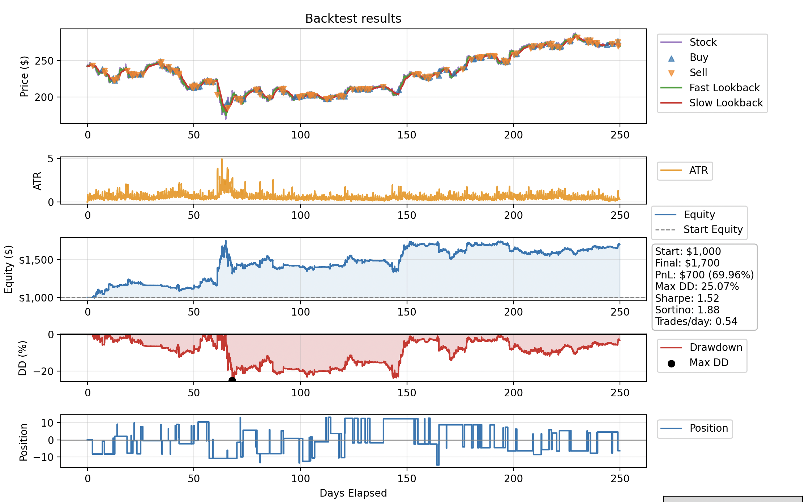
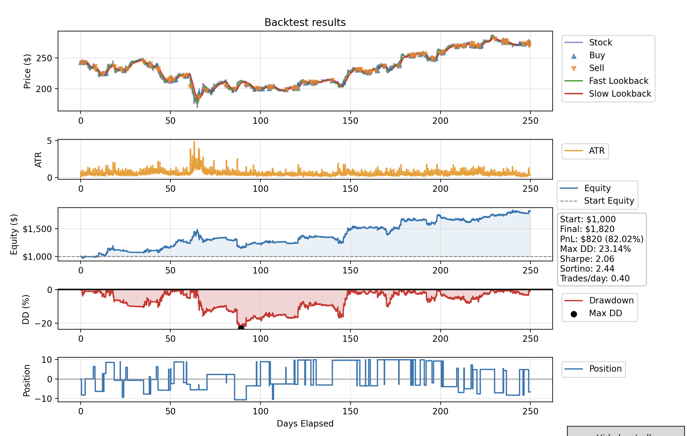

# Trading Engine

**Work-in-progress trading engine** featuring a **C++ event-driven backtesting engine**,  
CSV market-data ingestion, and a **Python front-end for visualisation and plotting**.

The goal of this project is to build a flexible research environment for developing and backtesting trading strategies.

---

## Overview

Core components:

- C++ event-driven backtesting engine
- Inbuilt Stop Loss system
- CSV market-data ingestion
- Python visualisation layer
- Strategy prototyping framework

Backtests currently include **transaction costs**:

- Slippage: **1.3 bps**
- Fee: **0.8 bps**

---

## Example Strategy

**EMA crossover signaller with volatility position sizing**  
tested on **AAPL 5-minute bars**

### Parameter Comparison

| EMA (24 / 120) | EMA (16 / 60) |
|---|---|
|  |  |

| EMA (30 / 150) | EMA (40 / 200) |
|---|---|
|  |  |

---

## Current Features

- [x] Historical CSV market-data ingestion
- [x] Event-driven backtesting engine
- [x] Python plotting interface
- [ ] Build system
- [ ] Further optimisation

---

## Future Work

Planned improvements:

- Build system 
- Engine performance optimisation
- Strategy parameter heatmaps
- Multi-asset backtesting
- Additional strategy modules
